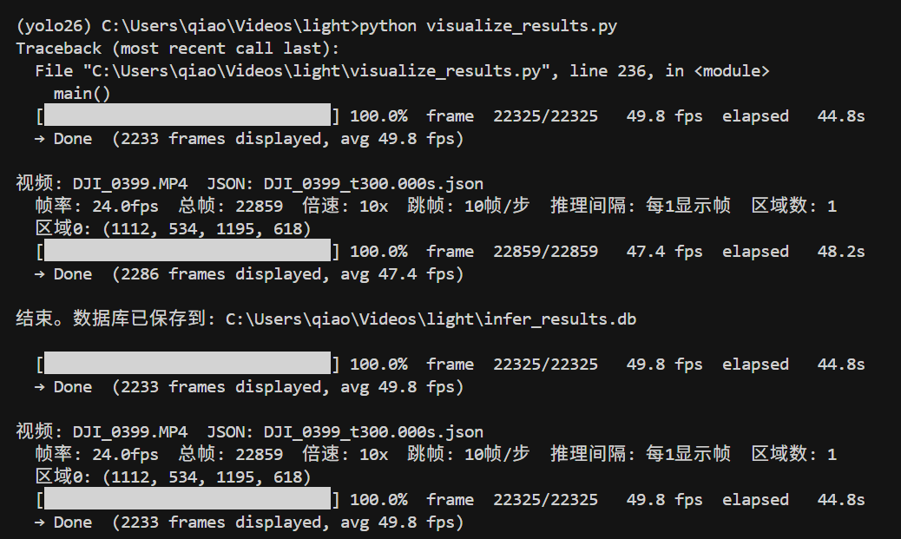
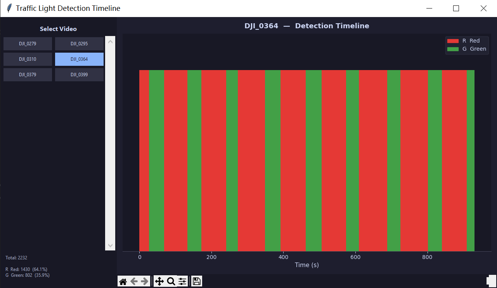

# 红绿灯识别 — 推理与结果可视化

本项目使用 YOLO 模型对无人机拍摄的原始视频进行红绿灯分类推理，并通过交互式时间轴界面浏览结果。

## 运行环境

使用 conda 环境 **yolo26**：

```bash
conda activate yolo26
```

主要依赖：

- Python 3.9+
- ultralytics（YOLO 推理）
- opencv-python
- numpy
- matplotlib
- tkinter（Python 标准库，无需额外安装）

NVIDIA GPU + CUDA 环境下可启用 FP16 半精度推理（`USE_HALF = True`），速度提升约 1.5–2×。

---

## infer_origin.py — 视频批量推理

对 `orgin-video/` 目录下的所有视频逐帧推理，将结果保存到 SQLite 数据库，可选实时预览。

### orgin-video 目录结构

脚本要求视频文件与对应的 LabelMe JSON 标注文件放在同一目录下，且 JSON 文件名以视频文件名为前缀：

```
orgin-video/
├── DJI_0279.MP4
├── DJI_0279_t300.000s.json   ← 同名前缀的标注文件（必须存在）
├── DJI_0310.MP4
├── DJI_0310_t300.000s.json
└── ...
```

JSON 为 LabelMe 格式，包含一个或多个 `Lamp` 矩形标注，脚本从中读取红绿灯裁剪区域：

```json
{
  "shapes": [{
    "label": "Lamp",
    "points": [[x1, y1], [x2, y2]],
    "shape_type": "rectangle"
  }]
}
```

文件命名规则：`{视频名}_t{任意后缀}.json`，如 `DJI_0279_t300.000s.json`。  
**若找不到对应 JSON，该视频会被自动跳过。**

同时，项目根目录下需要存在训练好的模型文件 `bestm.pt`。

### 运行

```bash
conda activate yolo26
python infer_origin.py
```


### 主要配置项（脚本顶部修改）

| 参数 | 默认值 | 说明 |
|---|---|---|
| `MODEL_PATH` | `bestm.pt` | YOLO 模型路径 |
| `VIDEO_DIR` | `orgin-video` | 视频目录 |
| `TARGET_WIDTH` | `640` | 裁剪区域放大后的宽度（像素） |
| `SPEED_MULT` | `40` | 跳帧倍数，40 = 每 40 帧处理 1 帧 |
| `INFER_EVERY` | `1` | 在跳帧基础上再每 N 帧推理一次 |
| `INFER_BATCH` | `32` | GPU 批量推理大小，>1 启用批推理（推荐 16–32） |
| `INTERP` | `cubic` | 插值算法：`nearest` / `linear` / `cubic` / `area` / `lanczos` |
| `USE_HALF` | `True` | FP16 半精度推理（需要 NVIDIA GPU） |
| `SHOW_VIDEO` | `True` | 是否弹出视频预览窗口 |
| `PREVIEW_FPS` | `5` | 预览帧率（仅 `SHOW_VIDEO=True` 时生效） |
| `DB_PATH` | `infer_results.db` | 推理结果数据库路径 |

### 推理流程

1. 扫描 `orgin-video/` 下所有 `.MP4`/`.mp4` 文件
2. 读取同目录下同名前缀的 JSON，解析 Lamp 矩形坐标
3. 每帧按 Lamp 区域裁剪，插值放大至 `TARGET_WIDTH` 宽度
4. 启用批推理时（`INFER_BATCH > 1`）：将多帧 crop 积攒到 `INFER_BATCH` 张后一次性送入 GPU 推理，显著减少 CUDA kernel 调用开销
5. 推理结果写入 SQLite 数据库 `infer_results.db`

### 预览操作（SHOW_VIDEO=True 时）

| 按键 | 功能 |
|---|---|
| 空格 | 暂停 / 继续 |
| N | 跳到下一个视频 |
| Q / ESC | 退出 |

### 数据库结构

结果保存在 `infer_results.db`，表名 `detections`：

| 字段 | 类型 | 说明 |
|---|---|---|
| `video` | TEXT | 视频文件名（不含扩展名） |
| `frame_idx` | INTEGER | 原始帧号 |
| `time_s` | REAL | 相对视频起点的时间（秒） |
| `region_idx` | INTEGER | Lamp 区域编号（0 起） |
| `label` | TEXT | 分类标签：`R`（红灯）或 `G`（绿灯）；无检测为 NULL |
| `confidence` | REAL | 置信度；无检测为 NULL |
| `box_x1/y1/x2/y2` | REAL | 检测框坐标（放大图坐标系） |

---

## visualize_results.py — 结果可视化

读取 `infer_results.db`，用交互式 Tkinter + Matplotlib 界面展示每个视频的检测时间轴。

### 运行

需先执行 `infer_origin.py` 生成数据库。

```bash
conda activate yolo26
python visualize_results.py
```



### 界面说明

- **左侧面板**：双列按钮列出数据库中所有视频，视频过多时可通过右侧滑块或鼠标滚轮滚动；点击按钮切换视频
- **右侧图表**：以时间（秒）为 X 轴的柱状时间轴；每帧对应一根等高柱子，颜色表示检测结果
- **左下角统计**：当前视频各标签的帧数及占比
- 图表支持 Matplotlib 标准工具栏（缩放、平移、保存图片）

### 标签含义

| 标签 | 颜色 | 含义 |
|---|---|---|
| `R` | 红色 | 红灯 |
| `G` | 绿色 | 绿灯 |
| `None` | 灰色 | 该帧无检测 |
